<div align="center">
  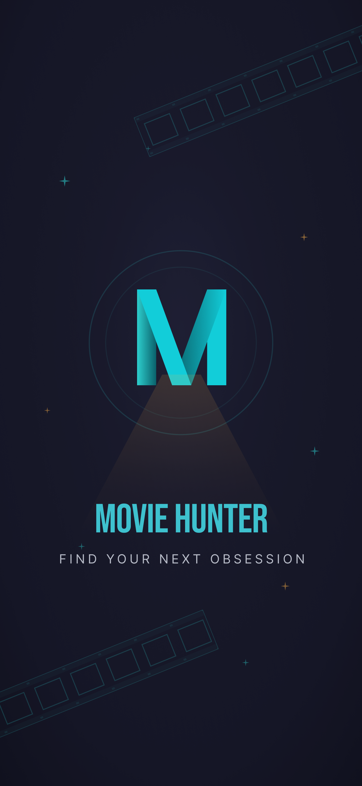

  # movie_hunter

  *Built as a portfolio project to demonstrate a production-style Flutter architecture.*

  [](https://flutter.dev/)
  [](https://dart.dev/)
  [](https://pub.dev/packages/flutter_bloc)
  [](https://www.themoviedb.org/)
  [](https://opensource.org/licenses/MIT)
</div>

## About

Built as a portfolio project to demonstrate a production-style Flutter architecture — Feature-First Clean Architecture, Cubit state management, and a full code-generation pipeline (Freezed, Retrofit, Envied) — applied to a real-world data-heavy app. It consumes the TMDB (The Movie Database) API to provide a comprehensive movie browsing and discovery experience.

## Features

- **Movies Exploration**: Browse all movies, view lists and grids.
- **Movie Details**: Deep dive into movie information, cast, and crew.
- **Search**: Search for specific movies or people.
- **Categories**: Browse movies by category/genre.
- **Person Details**: View cast member profiles and their known work.
- **Authentication**: User sign-up and login capabilities.
- **Account Management**: Profile and onboarding screens.

## Screenshots

<p align="center">
  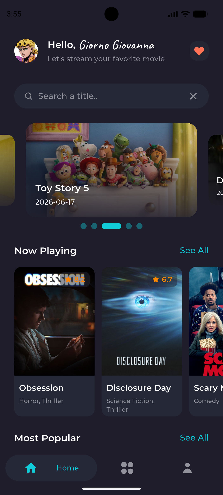
  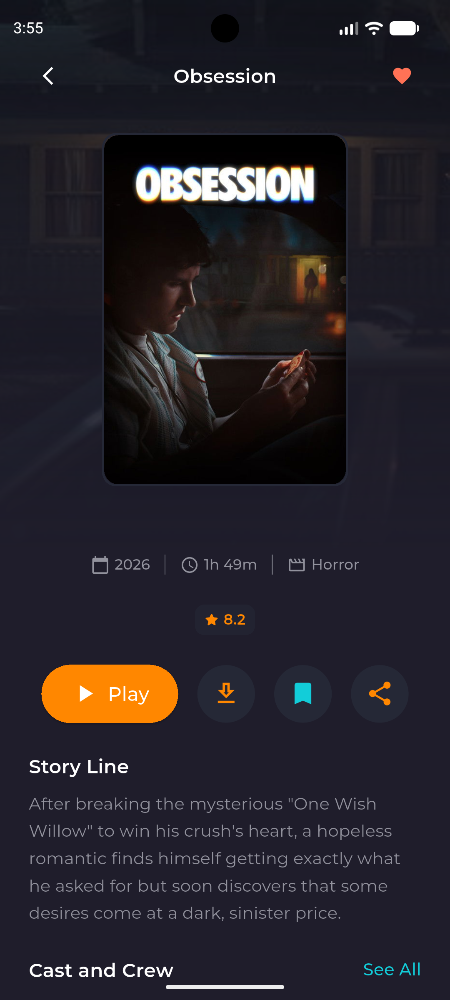
  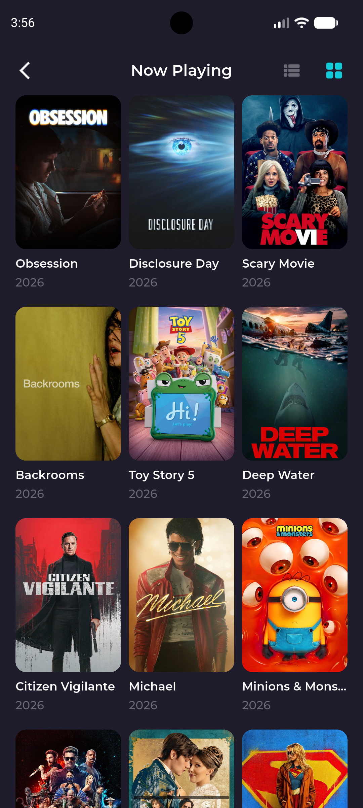
  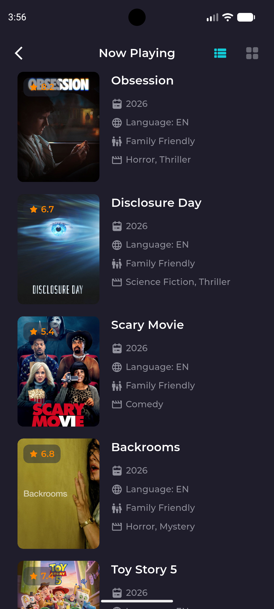
</p>
<p align="center">
  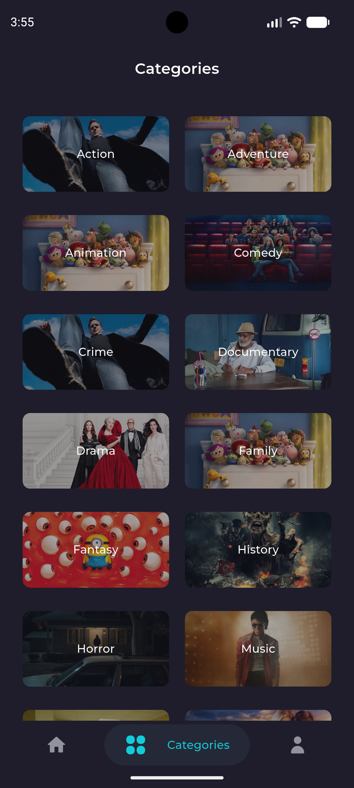
  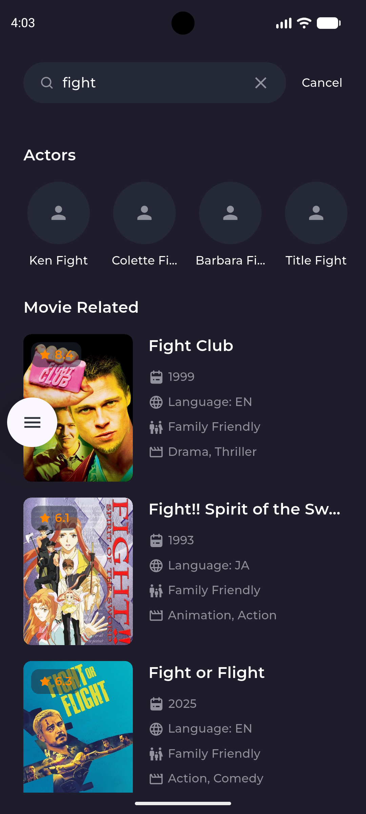
  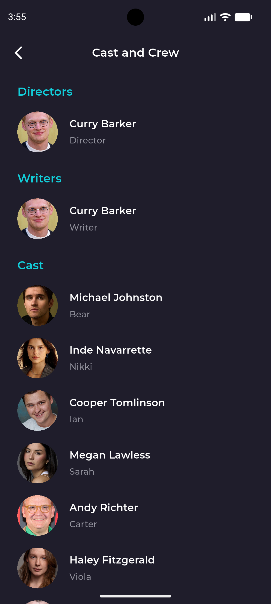
  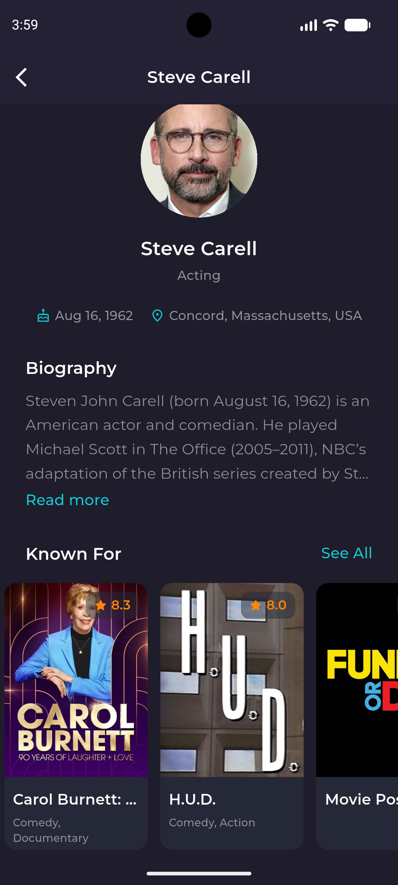
</p>
<p align="center">
  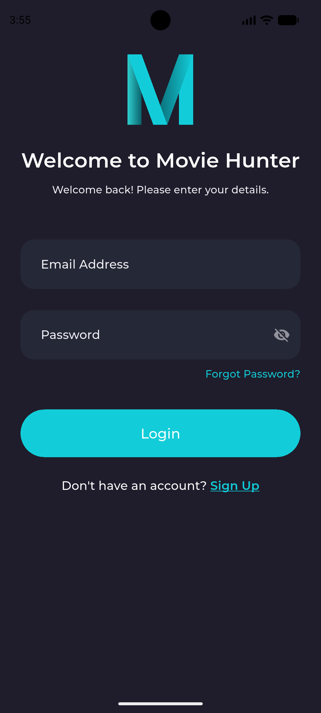
  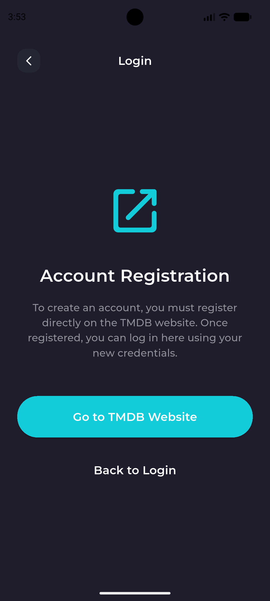
  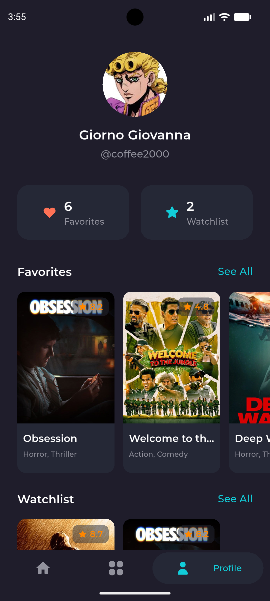
  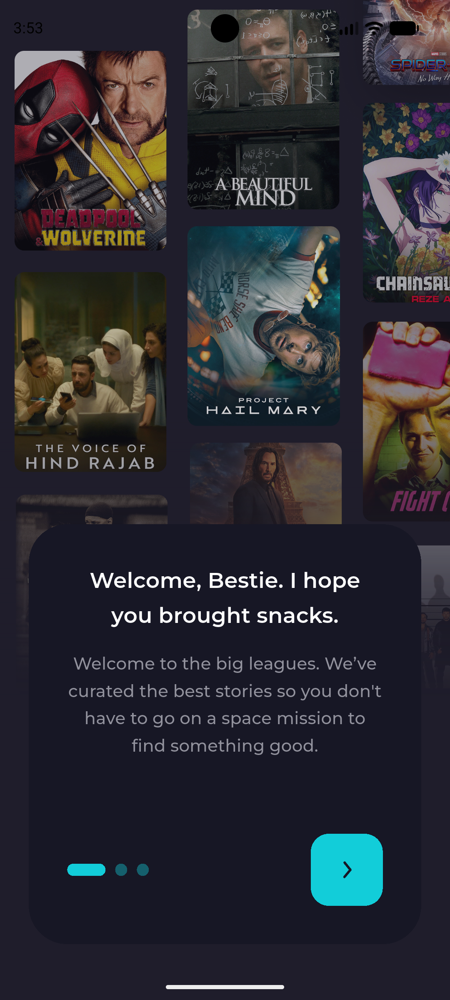
</p>

## Getting Started

### Prerequisites
- Flutter SDK `^3.10.1`
- A TMDB API Key

### Installation

1. Clone the repository:
   ```bash
   git clone https://github.com/BlueEye2077/movie-hunter.git
   ```
2. Navigate to the project directory:
   ```bash
   cd movie-hunter
   ```
3. Install dependencies:
   ```bash
   flutter pub get
   ```
4. Set up your environment variables. Create a `.env` file in the root directory and add your TMDB API key:
   ```env
   TMDB_API_KEY=your_api_key_here
   ```
5. Run the code generation (for Freezed, Retrofit, Envied):
   ```bash
   dart run build_runner build --delete-conflicting-outputs
   ```
6. Run the app:
   ```bash
   flutter run
   ```

## Architecture

The application follows a **Feature-First Clean Architecture**, structuring code by feature rather than layer, keeping components isolated and scalable.

```text
lib/
├── core/                   # Shared utilities, DI, network client, generic widgets
├── features/               # Feature modules
│   ├── account/            # Account & profile management
│   ├── all_movies/         # Grid and list views of movies
│   ├── auth/               # Login & Sign Up
│   ├── categories/         # Movie categories
│   ├── home/               # Main discovery dashboard
│   ├── movie_details/      # Specific movie data
│   ├── onboarding/         # Initial app walkthrough
│   ├── person_details/     # Cast & crew information
│   └── search/             # Movie and person search functionality
└── main.dart               # App entry point
```

Each feature directory typically contains its own `presentation` (UI and Cubits), `domain` (models, use cases), and `data` (repositories, API clients) layers to maintain separation of concerns.

## Tech Stack

- **Framework**: Flutter
- **State Management**: flutter_bloc (Cubit)
- **Dependency Injection**: get_it
- **Networking**: dio & retrofit
- **Data Models / Code Gen**: freezed & json_serializable
- **Local Storage**: shared_preferences & flutter_secure_storage
- **Environment Management**: envied

## API

The app connects to [TMDB (The Movie Database) API](https://developer.themoviedb.org/docs) to fetch real-time movie metadata, cast details, categories, and search results.

## Key Dependencies

- `flutter_bloc` `^9.1.1` - Predictable state management
- `get_it` `^9.2.1` - Service Locator / Dependency Injection
- `dio` `^5.9.2` - Powerful HTTP client
- `retrofit` `^4.9.2` - Retrofit type-safe HTTP client
- `freezed` `^3.2.5` - Code generation for immutable classes
- `cached_network_image_ce` `^4.6.4` - Caching network images
- `envied` `^1.3.7` - Secure handling of `.env` variables

## License

This project is licensed under the MIT License.
