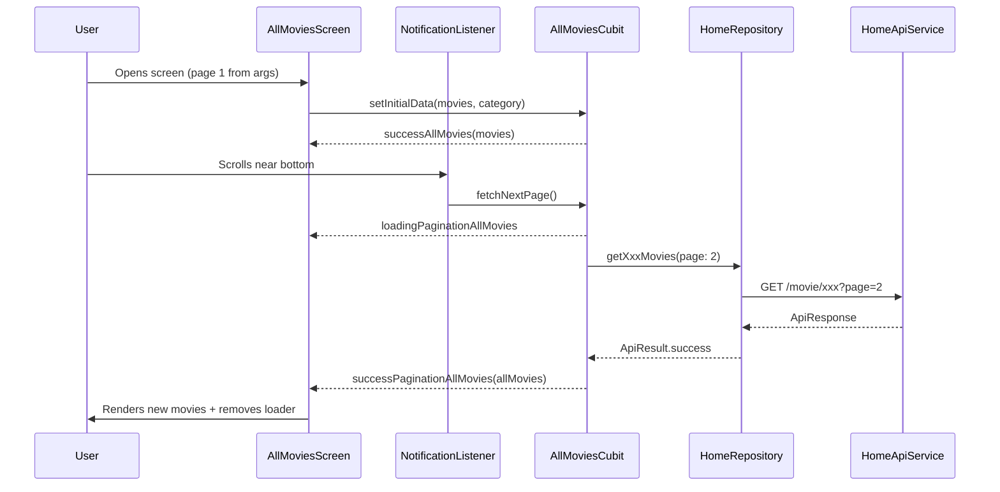

# Pagination Plan — All Movies Screen

## Overview

Add infinite-scroll pagination to the All Movies screen using `NotificationListener<ScrollNotification>`. The cubit fetches pages from the **existing `HomeRepository`** methods (no new API service needed). The first page of movies is still passed via `AllMoviesArgs` so the screen opens instantly; subsequent pages are fetched on scroll.

---

## Current State (What We Have)

| Layer | File | Status |
|-------|------|--------|
| **Args** | `all_movies_args.dart` | Has `title` + `movies` — missing **category identifier** and **page info** |
| **State** | `all_movies_state.dart` | Freezed states already defined (idle, loading, pagination loading/success, error) |
| **Cubit** | `all_movies_cubit.dart` | Empty shell — no methods, no repository |
| **UI** | `all_movies_screen.dart` | Displays static `List<Movie>` from args — no scroll listener |
| **Widgets** | `all_movies_grid_view.dart`, `all_movies_list_view.dart` | Accept a static `List<Movie>` — no pagination awareness |

---

## Implementation Steps

### Step 1 — Identify Which API to Call

The cubit needs to know **which** category of movies to fetch (popular, top-rated, now-playing, upcoming). The cleanest approach: pass a **category enum** in `AllMoviesArgs`.

**File:** `all_movies_args.dart`

```dart
import '../../../home/data/models/movie.dart';

/// Enum representing the movie category for pagination.
enum MovieCategory { popular, topRated, nowPlaying, upcoming }

class AllMoviesArgs {
  final String title;
  final List<Movie> movies;
  final MovieCategory category;

  const AllMoviesArgs({
    required this.title,
    required this.movies,
    required this.category,
  });
}
```

> [!IMPORTANT]
> You must also update the **3 builder widgets** on the home screen that create `AllMoviesArgs` to pass the correct `category` value.

**Files to update:**
- [most_popular_movies_builder.dart](file:///e:/Programming/Projects/movie_hunter/lib/features/home/ui/widgets/most_popular_movies_builder.dart#L47)
- [now_playing_movies_builder.dart](file:///e:/Programming/Projects/movie_hunter/lib/features/home/ui/widgets/now_playing_movies_builder.dart#L47)
- [top_rated_movies_builder.dart](file:///e:/Programming/Projects/movie_hunter/lib/features/home/ui/widgets/top_rated_movies_builder.dart#L47)

---

### Step 2 — Complete the Cubit

The cubit needs:
1. A dependency on `HomeRepository`
2. Internal tracking of `currentPage`, `totalPages`, and accumulated `movies` list
3. Two methods: `fetchFirstPage()` (uses initial data from args) and `fetchNextPage()`
4. Guard against duplicate fetch calls and end-of-pages

**File:** `all_movies_cubit.dart`

```dart
import 'package:flutter_bloc/flutter_bloc.dart';
import 'package:freezed_annotation/freezed_annotation.dart';

import '../../../../core/networking/api_result.dart';
import '../../../../core/networking/api_response.dart';
import '../../../../core/networking/network_exceptions.dart';
import '../../../home/data/models/movie.dart';
import '../../../home/data/repository/home_repository.dart';
import '../../data/models/all_movies_args.dart';

part 'all_movies_state.dart';
part 'all_movies_cubit.freezed.dart';

class AllMoviesCubit extends Cubit<AllMoviesState> {
  final HomeRepository homeRepository;

  AllMoviesCubit({required this.homeRepository}) : super(AllMoviesState.idle());

  // ── Internal pagination state ──
  int _currentPage = 1;
  int _totalPages = 1;
  List<Movie> _allMovies = [];
  bool _isFetching = false;
  late MovieCategory _category;

  /// Called once when the screen opens.
  /// Seeds the cubit with the movies already in hand (page 1 from home).
  void setInitialData({
    required List<Movie> movies,
    required MovieCategory category,
  }) {
    _category = category;
    _allMovies = List.from(movies);
    _currentPage = 1; // we already have page 1
    _totalPages = 2;  // assume at least 2 pages; will be corrected on next fetch
    emit(AllMoviesState.successAllMovies(_allMovies));
  }

  /// Called when the user scrolls near the bottom.
  Future<void> fetchNextPage() async {
    // Guards
    if (_isFetching) return;
    if (_currentPage >= _totalPages) return;

    _isFetching = true;
    final nextPage = _currentPage + 1;
    emit(AllMoviesState.loadingPaginationAllMovies());

    // Pick the correct repository method based on category
    final ApiResult<ApiResponse<Movie>> result = await _fetchByCategory(nextPage);

    result.when(
      success: (response) {
        _currentPage = response.page ?? nextPage;
        _totalPages = response.totalPages ?? _currentPage;
        _allMovies = [..._allMovies, ...response.results ?? []];
        _isFetching = false;
        emit(AllMoviesState.successPaginationAllMovies(_allMovies));
      },
      failure: (error) {
        _isFetching = false;
        emit(AllMoviesState.error(error));
      },
    );
  }

  /// Routes to the correct HomeRepository method.
  Future<ApiResult<ApiResponse<Movie>>> _fetchByCategory(int page) {
    switch (_category) {
      case MovieCategory.popular:
        return homeRepository.getPopularMovies(page: page);
      case MovieCategory.topRated:
        return homeRepository.getTopRatedMovies(page: page);
      case MovieCategory.nowPlaying:
        return homeRepository.getNowPlayingMovies(page: page);
      case MovieCategory.upcoming:
        return homeRepository.getUpcomingMovies(page: page);
    }
  }

  /// Whether we have reached the last page.
  bool get hasReachedMax => _currentPage >= _totalPages;
}
```

> [!NOTE]
> The cubit re-uses `HomeRepository` — no new API service or repository is needed. The `_totalPages` is initially set to `2` as a safe assumption; the real value arrives with the first API response.

---

### Step 3 — Run Build Runner

After editing the cubit/state files, regenerate the Freezed code:

```bash
dart run build_runner build --delete-conflicting-outputs
```

---

### Step 4 — Register the Cubit in DI

Since each "All Movies" screen is a **fresh instance** (different category each time), register as a **factory**, not a singleton.

**File:** `dependency_injection.dart`

```dart
// ── All Movies Feature ──
getIt.registerFactory<AllMoviesCubit>(
  () => AllMoviesCubit(homeRepository: getIt()),
);
```

---

### Step 5 — Provide the Cubit in the Router

**File:** `app_router.dart`

Update the `Routes.allMovies` case to:
1. Create a `BlocProvider` for `AllMoviesCubit`
2. Call `setInitialData` immediately after creation

```dart
case Routes.allMovies:
  final args = settings.arguments as AllMoviesArgs;
  return MaterialPageRoute(
    builder: (_) => MultiBlocProvider(
      providers: [
        BlocProvider.value(value: getIt<GenresCubit>()),
        BlocProvider(
          create: (_) => AllMoviesCubit(homeRepository: getIt())
            ..setInitialData(
              movies: args.movies,
              category: args.category,
            ),
        ),
      ],
      child: AllMoviesScreen(args: args),
    ),
  );
```

---

### Step 6 — Add `NotificationListener` in the Screen

Wrap the body of `AllMoviesScreen` with a `NotificationListener<ScrollNotification>`. When the user scrolls within a threshold of the bottom, trigger `fetchNextPage()`.

**File:** `all_movies_screen.dart`

Key changes:
- Read movies from the **cubit state** (not from `widget.args.movies`)
- Wrap `AnimatedSwitcher` body with `NotificationListener<ScrollNotification>`
- Use `BlocBuilder` to react to state changes
- Show a bottom loading indicator during `loadingPaginationAllMovies`

```dart
// Inside _AllMoviesScreenState

/// Scroll threshold: fetch more when within 200px of the bottom.
bool _onScrollNotification(ScrollNotification notification) {
  if (notification is ScrollUpdateNotification) {
    final maxScroll = notification.metrics.maxScrollExtent;
    final currentScroll = notification.metrics.pixels;
    // When within 200px of the bottom, fetch next page
    if (maxScroll - currentScroll <= 200) {
      context.read<AllMoviesCubit>().fetchNextPage();
    }
  }
  return false; // don't consume the notification
}
```

> [!TIP]
> Return `false` from the notification handler so that the scroll notification continues to propagate to inner scroll widgets (important for `ScrollMetrics` accuracy).

---

### Step 7 — Update the Grid/List Views

Both `AllMoviesGridView` and `AllMoviesListView` need a small change:
- Accept an optional `isLoadingMore` boolean
- When `isLoadingMore` is true, show an extra item at the end (a `CircularProgressIndicator`)

**Example for `AllMoviesGridView`:**

```dart
// Add to the widget
final bool isLoadingMore;

// In GridView.builder
itemCount: movies.length + (isLoadingMore ? 1 : 0),
itemBuilder: (context, index) {
  if (index >= movies.length) {
    return const Center(child: CircularProgressIndicator());
  }
  // ... existing movie item code
},
```

Same pattern for `AllMoviesListView`.

---

### Step 8 — Putting It All Together in the Screen

Here is the rough structure of the updated `build()` method:

```dart
@override
Widget build(BuildContext context) {
  final genresState = context.watch<GenresCubit>().state;
  final List<Genre> genres = genresState.when(
    idle: () => [],
    loading: () => [],
    success: (g) => g,
    error: (_) => [],
  );

  return Scaffold(
    backgroundColor: AppColors.primaryDark,
    appBar: /* ... same AppBar ... */,
    body: BlocBuilder<AllMoviesCubit, AllMoviesState>(
      builder: (context, state) {
        // Extract movies and loading flag from state
        final List<Movie> movies = state.when(
          idle: () => widget.args.movies,
          loading: () => [],
          loadingAllMovies: () => [],
          loadingPaginationAllMovies: () => _lastKnownMovies, // keep showing existing
          successAllMovies: (data) => data,
          successPaginationAllMovies: (data) => data,
          error: (_) => _lastKnownMovies,
        );
        
        final bool isLoadingMore = state is LoadingPaginationAllMovies;
        
        // Cache for use during loading/error states
        _lastKnownMovies = movies;

        return NotificationListener<ScrollNotification>(
          onNotification: _onScrollNotification,
          child: AnimatedSwitcher(
            duration: const Duration(milliseconds: 250),
            child: _isGridView
                ? AllMoviesGridView(
                    key: const ValueKey('grid'),
                    movies: movies,
                    genres: genres,
                    isLoadingMore: isLoadingMore,
                  )
                : AllMoviesListView(
                    key: const ValueKey('list'),
                    movies: movies,
                    genres: genres,
                    isLoadingMore: isLoadingMore,
                  ),
          ),
        );
      },
    ),
  );
}
```

> [!NOTE]
> `_lastKnownMovies` is a field in the `State` class — it caches the latest movie list so we can keep showing it during `loadingPagination` or `error` states (no flickering).

---

## Summary Checklist

| # | Task | File(s) |
|---|------|---------|
| 1 | Add `MovieCategory` enum + update `AllMoviesArgs` | `all_movies_args.dart` |
| 2 | Update home builders to pass `category` | 3 builder files in `home/ui/widgets/` |
| 3 | Complete `AllMoviesCubit` with page tracking + `fetchNextPage()` | `all_movies_cubit.dart` |
| 4 | Run `build_runner` to regenerate Freezed code | Terminal |
| 5 | Register `AllMoviesCubit` as factory in DI | `dependency_injection.dart` |
| 6 | Update router to provide `AllMoviesCubit` + call `setInitialData` | `app_router.dart` |
| 7 | Add `isLoadingMore` to grid & list views + show bottom loader | `all_movies_grid_view.dart`, `all_movies_list_view.dart` |
| 8 | Wrap screen body with `NotificationListener` + `BlocBuilder` | `all_movies_screen.dart` |

---

## Architecture Diagram


